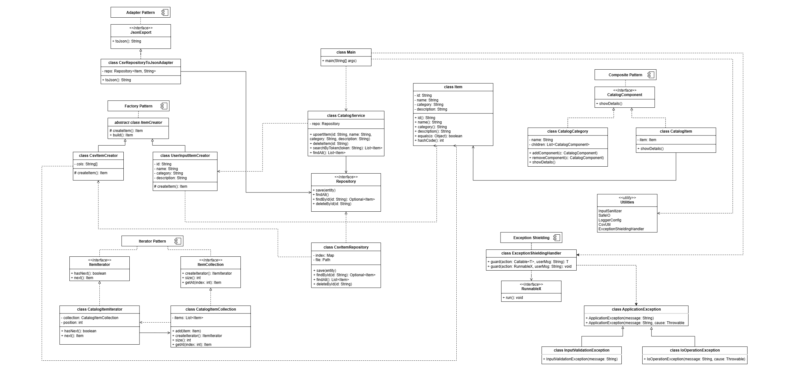
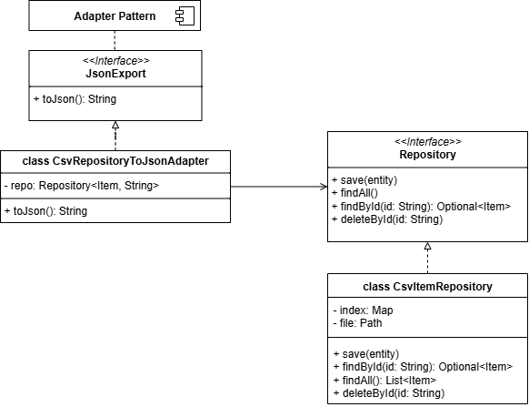

# Imaginarium Catalog CLI

## 📖 Overview
Imaginarium is a **command-line catalog management application** developed in **Java SE 21** and built with **Maven**.  
It provides a safe, structured, and extensible way to manage items in a catalog, supporting operations such as:

- Add or update catalog items
- Delete items by ID
- List all items
- Search items by keyword
- Display items grouped by categories using the **Composite pattern**
- Iterate items with a **custom Iterator** implementation
- Export the catalog to JSON via an **Adapter** around a CSV repository

---

## 📊 Project UML
The following UML diagram summarizes the project architecture:



---

## 🛠️ Technologies and Patterns Used

### Core Technologies
- **Java SE 21** – Modern language features, sealed classes, records, strong typing.
- **Maven 3.9+** – Build and dependency management.
- **JUnit** – Testing framework (suite available in `/src/test/java/it/fpili/imaginarium`).

### Design Patterns (with Structure and Justification)

#### 1. Factory Method

- **Participants**:
    - `ItemCreator` (abstract creator)
    - `CsvItemCreator` (concrete creator from CSV)
    - `UserInputItemCreator` (concrete creator from user input)
- **Intent**: Delegate instantiation of `Item` objects to specialized creators.
- **Why**: Keeps object creation consistent and encapsulated. CLI logic and persistence logic don’t need to know *how* to build `Item`s; they just rely on the factory.
- **Benefit**: Extensible – new item sources (e.g., XML, DB rows) could be added easily by implementing a new creator.

#### 2. Composite

- **Participants**:
    - `CatalogComponent` (component interface)
    - `CatalogCategory` (composite node)
    - `CatalogItem` (leaf node)
- **Intent**: Build tree structures of items grouped by categories, where both leaves and groups are treated uniformly.
- **Why**: A category tree is a natural fit for catalogs. The Composite pattern allows recursive printing (`showDetails()`) without the client knowing whether it’s dealing with a single item or a category.
- **Benefit**: Simple extensibility: subcategories or nested groups can be supported in future without changing client code.

#### 3. Iterator

- **Participants**:
    - `ItemIterator` (interface)
    - `CatalogItemIterator` (concrete iterator)
    - `ItemCollection` (aggregate interface)
    - `CatalogItemCollection` (concrete aggregate)
- **Intent**: Provide a way to traverse items without exposing the internal `List` representation.
- **Why**: Demonstrates separation between collection and traversal logic.
- **Benefit**: Easy to extend with alternative iteration strategies (e.g., reverse order, filtering iterators).

#### 4. Adapter

- **Participants**:
    - `JsonExport` (target interface)
    - `CsvRepositoryToJsonAdapter` (adapter)
    - `CsvItemRepository` (adaptee)
- **Intent**: Allow a CSV-based repository to be exported as JSON, which modern clients expect.
- **Why**: Avoids rewriting the repository layer. Instead, we adapt it to a new interface.
- **Benefit**: Clean separation of concerns: persistence remains CSV, while clients can still get JSON output.

#### 5. Exception Shielding

- **Participants**:
    - `ExceptionShieldingHandler`
- **Intent**: Prevent low-level technical errors from leaking to users. Instead, controlled `ApplicationException` messages are shown.
- **Why**: Improves robustness and user experience for a CLI tool.
- **Benefit**: Logging captures the details, user sees safe messages.

#### 6. Utility Abstractions
- **InputSanitizer**: Applies strict allowlist validation to prevent invalid/unsafe input.
- **SafeIO**: Encapsulates file operations, always in UTF-8, with controlled error wrapping (`IoOperationException`).
- **LoggerConfig**: Provides centralized logging with rotating file handlers and console output.

---

## ⚙️ How to Run
- Clone the repository
```bash
git clone https://github.com/f-pili/Imaginarium.git
cd Imaginarium
```
- Ensure Java 21 and Maven are installed
```bash
java -version
mvn -version
```

- Compile the project using Maven
```bash
mvn clean compile
```

- Run the application using Maven
```bash
mvn exec:java -Dexec.mainClass="it.fpili.imaginarium.Main"
```

---

## 🧪️ How to Tests

- Run the full test suite with JUnit
```bash
mvn test
```

---

## ⚠️ Known Limitations
- CSV persistence is **not concurrent-safe** beyond simple CLI use.
- Input sanitization is intentionally **conservative** and may reject characters unnecessarily.
- JSON export is **manually built** (no external libraries), supporting only basic escaping.
- The application is **CLI-only** (no GUI or web interface).

---

## 🔮 Future Work
- Add **database-backed repository** (e.g., JDBC, JPA) for scalability.
- Extend JSON export to use a proper JSON library (e.g., Jackson).
- Implement more advanced **search/filtering capabilities**.
- Add **user roles and authentication** for multi-user scenarios.
- Provide a **web frontend** to complement the CLI.